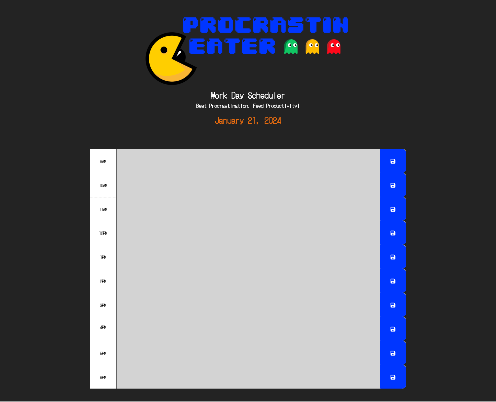
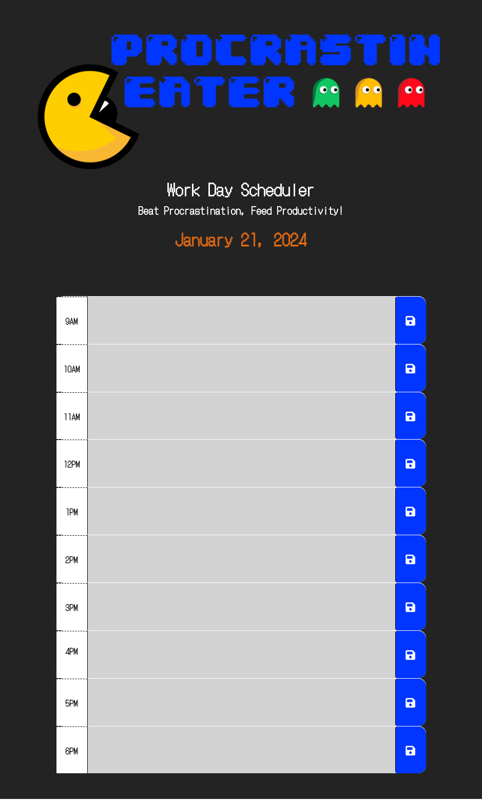
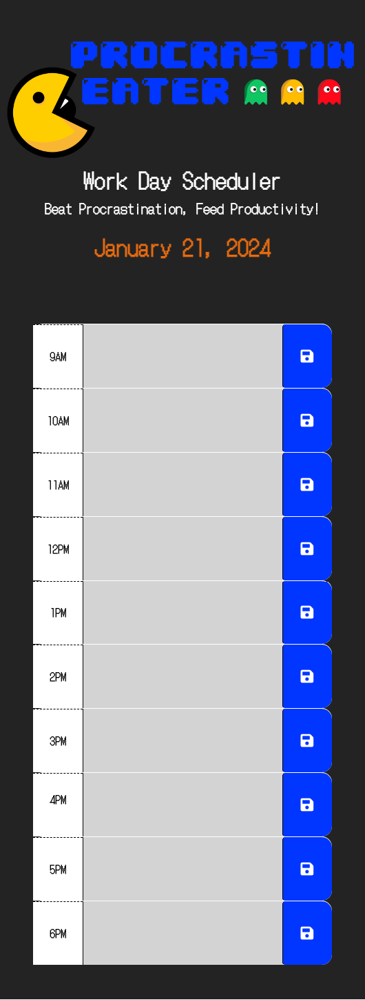

# Procrastin-Eater

## Project Description
Procrastin-Eater is your go-to workday scheduler, designed to devour procrastination and boost productivity. With an intuitive interface, this web app allows you to organize your tasks effortlessly. Stay on top of your day by scheduling events for each hour, dynamically color-coded to indicate past, present, and future time slots. Procrastin-Eater doesn't just manage your work; it devours procrastination, ensuring you make the most of every moment. Save your tasks, enjoy seamless local storage persistence, and conquer your workday with Procrastin-Eater!

## Functionalities
1. Dynamic Time Blocks: Organize your workday with hourly time blocks that dynamically change colors based on past, present, and future times, providing a visual overview of your schedule.
2. Local Storage Persistence: Save your tasks with a click of a button, and enjoy seamless local storage persistence. Your scheduled events persist even after refreshing the page, ensuring you never lose track of your plans.
3. Effortless Task Management: Easily input and manage your tasks for each hour, keeping your workday organized and efficiently tackling procrastination with the Procrastin-Eater Workday Scheduler.

## Mock-Up
The following image shows the web application's appearance on desktops' screen:

The following image shows the web application's appearance on tablets' screen:

The following image shows the web application's appearance on smartphones' screen:

## Credits
- [w3schools.com](https://www.w3schools.com/)
- [developer.mozilla.org](https://developer.mozilla.org/en-US/)
- [getbootstrap.com](https://getbootstrap.com/docs/5.3/getting-started/introduction/)
- [jquery.com](https://api.jquery.com/)
- [Days.js](https://day.js.org/en/)

## Repository and Webpage link

- [Repository Link](https://github.com/marphco/procrastin-eater)
- [Deployed Application Link](https://marphco.github.io/procrastin-eater/)